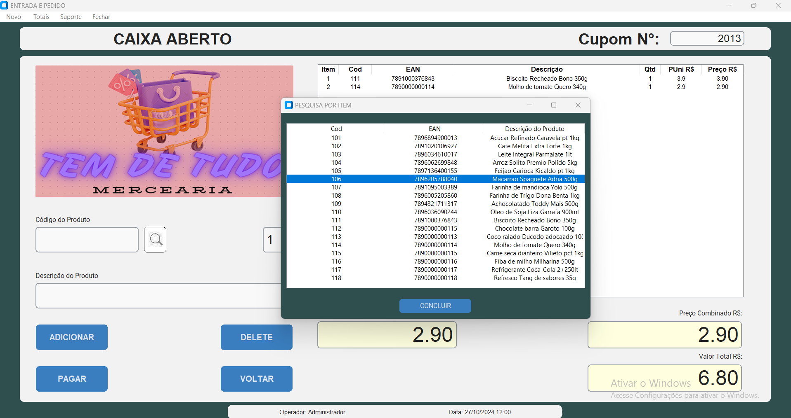

# VALQUIRIA APP VENDAS


## Sistema de Cobrança em Caixa de Supermercados

O projeto VALQUÍRIA é um sistema de registro do tipo 'Caixa Registradora'. Utiliza a biblioteca CustomTkinter para criar uma interface gráfica moderna e facilita a gestão de vendas em supermercados e estabelecimentos similares. 
O VALQUIRA esta conectado a um banco de dados integrado SQLite que permite o aquivamento de vendas e a visualização por meio de comando SQL em tabelas relacionadas.

## Tecnologias Usadas

-  **Python 3.7+**
-  **CustomTkinter**: Para criação de interface gráfica.
-  **JSON**: Manipulação de dados persistentes.
-  **ReportLab**: Geração de PDFs.
-  **SQLite**: Banco de dados leve e embutido.


## Funcionalidades

### Gestão de permisões

- **Abertura e Fechamento do Caixa**: possui tela de loguin que permite logar com permissões diferenter para cada usuario com validadção de usuario senha e razão socialControle do estado do caixa, abertura de novos cupons e fechamento ao final das operações.

### Registro de Vendas

- **Nova Compra**:Controle do estado do caixa, validação de CPF, abertura de novos cupons e fechamento ao final das operações.  
- **Adicionar Itens ao Carrinho**: Permite adicionar produtos ao carrinho de compras com base no código e EAN ou retorno via pesquisa. Ecessa o banco de dados, valoda o a entrada via ean, e mostra os valore e quantidades nos campos determinados.
- **Remover Itens do Carrinho**: Permite remover produtos já adicionados ao carrinho por meio do botão DELETE. Permite marcar um item na tabela itens e remover o valor correspondente na soma total de itens.
- **Atualização de Preços e Totais**: Calcula automaticamente os preços unitários e totais dos itens no carrinho e retorna no campo especifico.
- **Voltar**: cancela a operação e retorna ao estado inicial ao limpar os valores nos campos saidas.

### Consulta de Produtos

- **Pesquisa de Produtos**: Permite visualizar ou retornar produtos no banco de dados pelo código, descrição ou ean. retorna a linha selecionada na tabela

### Cadastro de Produtos

- **Adicionar Novos Produtos**: Permite o cadastro de ean, descrição e preço de novos produtos no sistema. Essa funcionalidade possui tratamento de erros e formatação de valores nos campos de entradas

### Pagamentos

- **Processamento de Pagamentos**: Calcula o valor total a pagar e registra a venda em dinheiro, cartão ou pix. O pagamento permite uma condição de informar o valor entregue se a opção 'dinheiro' for marcada, possibilitando o calculo de troco.
- **Banco de dados SQLite**: coleta dados da empresa, cliente, Usuario logado, data, produtos selecionados e efetua o registro nas tabelas relacionadas a venda e a produtos. É validada e existencia ou a criação de tabelas e é efutuado o registro da compra.


### Relatórios

- **Visualização de Vendas Realizadas**: Exibe o registro de todas as vendas salvas no bd SQLite a partir do numero do cupom. O botão combobox exibe todos os registros de vendas do banco de dados.

### Geração de PDFs

- **Impressão de Compras em PDF**: Gera um recibo da compra em formato PDF para impressão. O modulo impressão recebe os dados e gera um arquivo pdf.

## Estrutura do Projeto

O projeto é composto por mudulos que correspondem a funcionalidades distintas para organizar e manter a legibilidade do codigo.

```plaintext
├── modulo_entra.py
    ├── dados
    │   ├── bd.txt
    |   ├── ajuda.txt
    ├── modulo_registra.py
    │   ├── modulo_pagar.py
            ├── modilo_arquivar.py
                ├── SQLite
    │   ├── modulo_remover.py
    ├── ├── modulo_pesquisar.py
            ├── bd.txt
    │   ├── modulo_limpar.py
    │   ├── modulo_adicionar.py
            ├── bd.txt
    ├── modulo_visualisar.py
    │   ├── modulo_imprimir.py
            ├── SQLite
            ├── pdf
    ├── modulo_cadastro.py
        ├── bd.txt
    │
    └── dependencias
        └── imagem_venda.png
```
## Instalação
- **Download**: Faça o download de todos os modulos em uma pasta e execute com o editor da sua preferencia(obs: Tenha python 3 instalado)
- **Dependecias**: copie a pasta dependecia pra que o codigo possa ser executado sem quebas".
- **Bilbliotecas**: instale as bibliotecas reportlab e custotkinter.

## Desenvolvedor
- **Deleon Santos**: Este é um projeto autoral para fins academico e segue conforme aprendo novas tecnologias ou maneiras de resolver problemas.

## Versão
- **v5.1.7**


