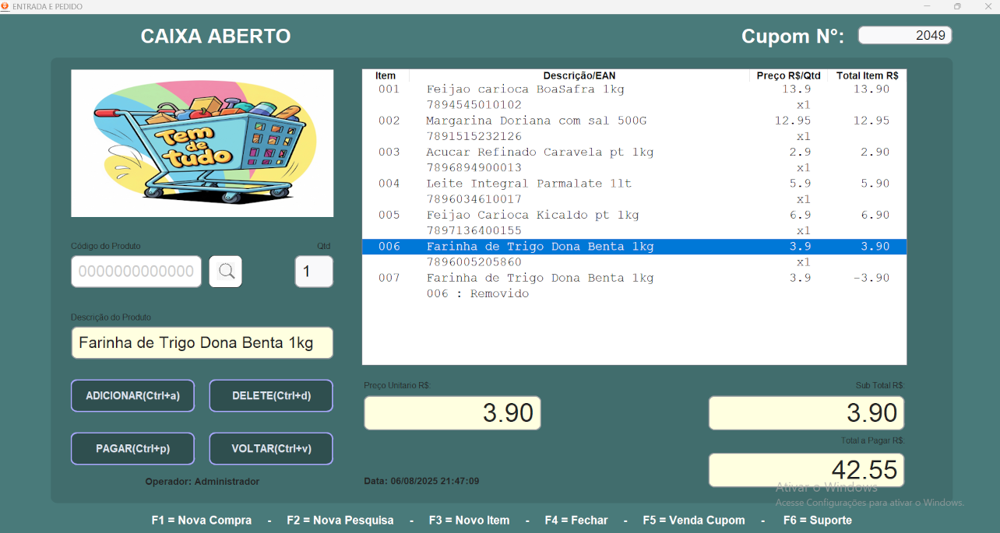
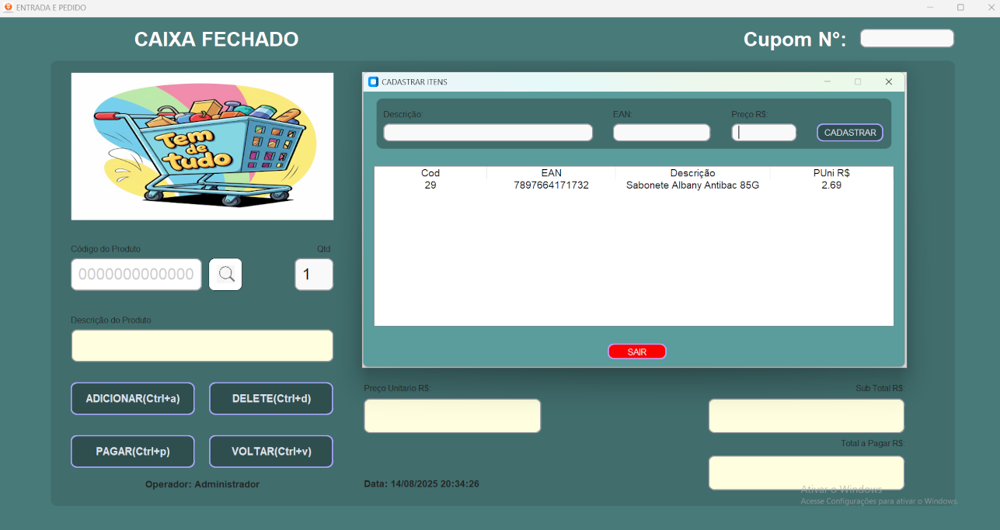
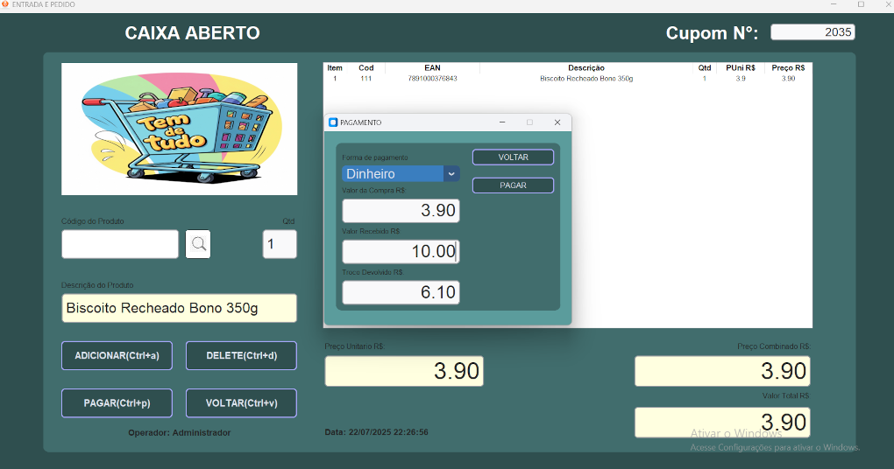

# VALQUIRIA APP VENDAS

## Sistema de Cobrança em Caixa de Supermercados

@@ -18,33 +18,33 @@ O VALQUIRA esta conectado a um banco de dados integrado SQLite que permite o aqu
## Funcionalidades

### Gestão de permisões

- **Abertura e Fechamento do Caixa**: possui tela de loguin que permite logar com permissões diferenter para cada usuario com validadção de usuario senha e razão socialControle do estado do caixa, abertura de novos cupons e fechamento ao final das operações.

### Registro de Vendas

- **Nova Compra**:Controle do estado do caixa, validação de CPF, abertura de novos cupons e fechamento ao final das operações.  
- **Adicionar Itens ao Carrinho**: Permite adicionar produtos ao carrinho de compras com base no código e EAN ou retorno via pesquisa. Ecessa o banco de dados, valoda o a entrada via ean, e mostra os valore e quantidades nos campos determinados.
- **Remover Itens do Carrinho**: Permite remover produtos já adicionados ao carrinho por meio do botão DELETE. Permite marcar um item na tabela itens e remover o valor correspondente na soma total de itens.
- **Atualização de Preços e Totais**: Calcula automaticamente os preços unitários e totais dos itens no carrinho e retorna no campo especifico.
- **Voltar**: cancela a operação e retorna ao estado inicial ao limpar os valores nos campos saidas.

### Consulta de Produtos

- **Pesquisa de Produtos**: Permite visualizar ou retornar produtos no banco de dados pelo código, descrição ou ean. retorna a linha selecionada na tabela

### Cadastro de Produtos

- **Adicionar Novos Produtos**: Permite o cadastro de ean, descrição e preço de novos produtos no sistema. Essa funcionalidade possui tratamento de erros e formatação de valores nos campos de entradas

### Pagamentos

- **Processamento de Pagamentos**: Calcula o valor total a pagar e registra a venda em dinheiro, cartão ou pix. O pagamento permite uma condição de informar o valor entregue se a opção 'dinheiro' for marcada, possibilitando o calculo de troco.
- **Banco de dados SQLite**: coleta dados da empresa, cliente, Usuario logado, data, produtos selecionados e efetua o registro nas tabelas relacionadas a venda e a produtos. É validada e existencia ou a criação de tabelas e é efutuado o registro da compra.

### Relatórios

- **Visualização de Vendas Realizadas**: Exibe o registro de todas as vendas salvas no bd SQLite a partir do numero do cupom. O botão combobox exibe todos os registros de vendas do banco de dados.

### Geração de PDFs

- **Impressão de aquivo pdf**: Exibe em formato pdf pronto para impressão para qualquer documento de compra.

### Licensa de iso 
- Esta sob a lisensa MIT 

